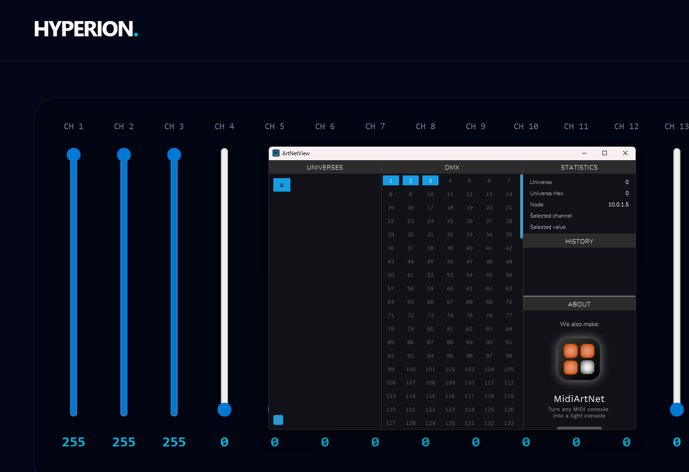

# Contributing Guidelines

Thanks for your interest in contributing to `Hyperion`! Since this project is licensed under GPLv3, we value everyones input.

## Getting Started

We follow a self-directed workflow. You do not need to wait for an official assignment to start working on something.

1. **Find an Issue:** Browse the issues for existing tasks or bugs or open a new issue with a new feature.
2. **Declare your interest:** Once you decide to work on an issue, please leave a brief comment (e.g., *"I'm looking into this"*) to inform others and avoid duplicated effort.
3. **Ask for help:** If you have questions regarding the implementation or the codebase, feel free to ask directly within the relevant issue. We are happy to provide guidance.

### Starting Hyperion backend

Hyperion provides two ways of deploying

## Technical Standards

### Documentation

* **Docstrings:** All Python code must use for docstrings, as this helps others to understand what the code does.
* **Licence:** Every new file must include the standard GPLv3 boilerplate header.
* **Pull Requests:** In the pull request briefly summarise your changes in a few sentences.

### Authorship & Headers

We encourage contributors to take credit for their work.

* If you make changes or create a new file, please add your name/alias and email to the copyright notice in the file header.
* **Format:** `Copyright (C) 2025  Your Name <your@email.com>`
* If you don't feel comfortable exposing your email and/or name, you can use your personal GitHub No-Reply email and your handle instead.
* GitHub Documentation: [Using your no-reply email](https://docs.github.com/en/account-and-profile/reference/email-addresses-reference#your-noreply-email-address) 

## For Beginners

If you are new to open-source or this project:

* **Start Small:** Look for issues labelled `good first issue` or help with documentation and tests.
* **Incremental PRs:** Small, focused Pull Requests are easier to review and merge than large, monolithic changes.
* **Local Testing:** Please ensure your changes are tested locally before submitting a Pull Request.
* **Feedback:** Do not worry if your first PR needs changes. Code review is a standard part of the process and a great way to learn.

## Software Tests

While hyperion has currently no pytests available, there are plans to implement them in the near future.
It is generally a good practice to test your code before submitting changes.

## Testing DMX Outputs

To verify that DMX data is being transmitted correctly over the network, we recommend using artnetview. It is an excellent tool for real-time visualisation of Art-Net traffic and does not require any external hardware, DMX devices etc.

### How to Test:

Since this is a minimal MVP, there is no UI existing which makes things easier.

Monitor Universes: Observe the grid to ensure that the correct Art-Net universes are being broadcast.
Verify Values: Trigger a change in the software and confirm that the corresponding faders or channel values in artnetview react as expected.
Network Setup: If you do not see any traffic, ensure that your firewall allows UDP traffic on port 6454 and that the application is bound to the correct network interface.

[Link to artnetview](https://artnetview.com/)

If everything worked, it should look like this:

## Pull Request Process

1. Fork the repository and create your branch from `master`.
2. Ensure your code adheres to the project's documentation standards.
3. Link your Pull Request to the issue it addresses (e.g., `Closes #123`).
4. By submitting a PR, you agree that your contributions will be licensed under the **GPLv3 or later**.

