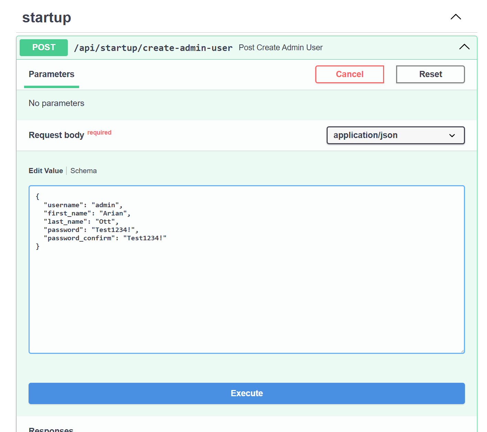
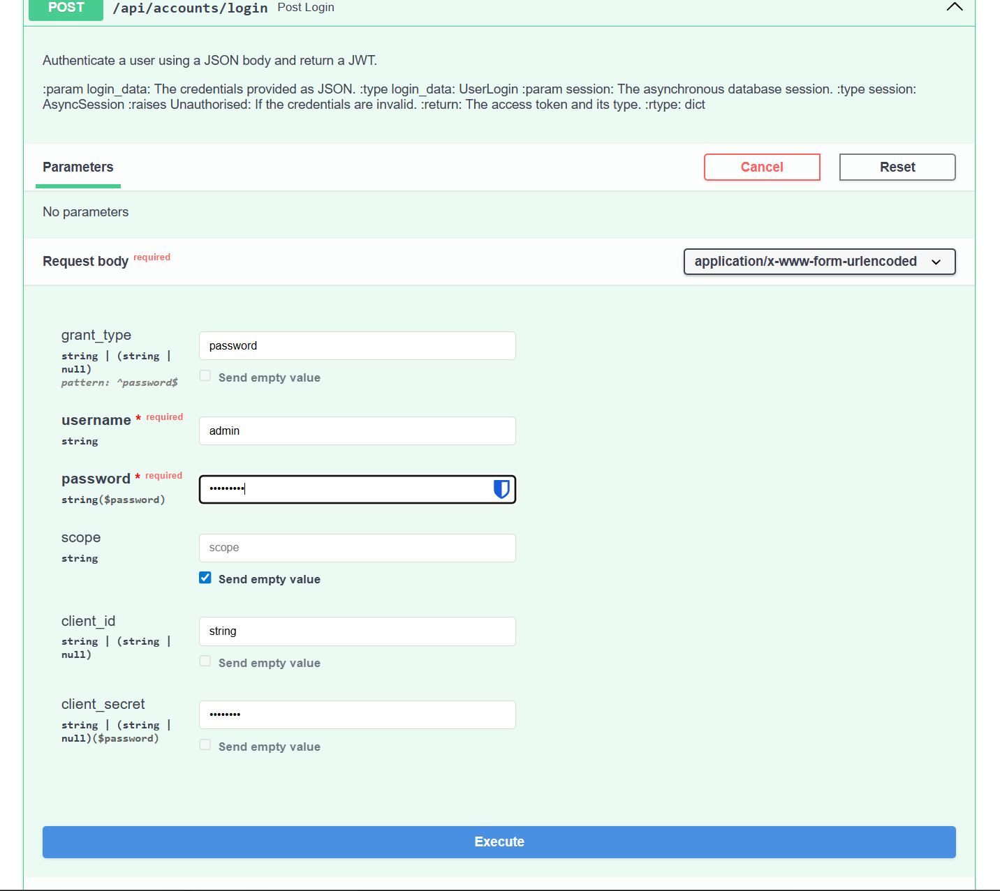

# Getting started

> [!important]
> If you want to develop with hyperion, make sure to jump to the Section ["Developing with hyperion"](#developing-with-hyperion)

Hyperion can be started in two different ways, depending on your preference and setup.

Options:

1. Docker (convenient, little setup effort)
2. Manual install (high performance, medium setup effort)

Docker is recommended if you want to try Hyperion, develop for it or want to host it without
being distracted by some configurations and installations.

Manual installation makes sense if you want to avoid docker overhead or prefer hosting your own
databases in your own environment.

## Docker

```sh
docker compose up -d backend
```

## Developing with hyperion

**Requirements:**

* UV Package manager (see: [Documentation: Install uv](https://docs.astral.sh/uv/getting-started/installation/))
* Docker (see: [Documentation: Get started with Docker](https://www.docker.com/get-started/))
* Python3

Permanently rebuilding docker images during development is really annoying and slows down development speed. Hyperion uses **Redis** and **MariaDB** as its main databases. For a full breakdown on the architecture, refer to the [CONTRIBUTING.md](CONTRIBUTING.md). This section only describes on how to start hyperion backend.


By default, hyperion comes with two example `.env` files:

* `.env.example` (granular configuration, manual deployments)
* `.env.docker` (minimal configuration, docker deployments)

**For a docker deployment, only the `.env.docker` is relevant**

### Environment Setup

Hyperion uses a smart configuration that works for both Docker and local development with a single file.

1. Go to the project root directory.
2. Copy the example configuration:
   * **Linux/Mac:** `cp .env.example .env`
   * **Windows:** `copy .env.example .env`

> [!CAUTION]
> Always generate secret JWT keys. The example file contains insecure defaults. In production, always generate a secure and secret JWT token.

### Python venv

> [!important]
> This section assumes you have UV already installed and configured. If you need to install uv, refer to the [uv documentation](https://docs.astral.sh/uv/getting-started/installation/)

Hyperion uses UV as its packaging manager. UV is a rust based pypi compatible packaging manager, which helps us organise our dependencies.

#### Installing Python

To get python3.14, simply run

```sh
uv python install 3.14
```

UV will install Python 3.14 for you. You can verify your installation running:

```sh
uv python list
```
This will give you a neat list of all available python installations.

Mine looks like this:

```txt
cpython-3.14.0-windows-x86_64-none                   C:\Python314\python.exe
cpython-3.14.0b1-windows-x86_64-none                 <download available>
cpython-3.14.0b1+freethreaded-windows-x86_64-none    <download available>
cpython-3.13.4-windows-x86_64-none                   C:\Users\<USER>\AppData\Roaming\uv\python\cpython-3.13.4-windows-x86_64-none\python.exe
cpython-3.13.4+freethreaded-windows-x86_64-none      <download available>
cpython-3.13.2-windows-x86_64-none                   C:\Program Files\Python313\python.exe
cpython-3.13.2+freethreaded-windows-x86_64-none      C:\Program Files\Python313\python3.13t.exe
cpython-3.12.11-windows-x86_64-none                  C:\Users\<USER>\AppData\Roaming\uv\python\cpython-3.12.11-windows-x86_64-none\python.exe
cpython-3.12.10-windows-x86_64-none                  C:\Users\<USER>\AppData\Local\Microsoft\WindowsApps\PythonSoftwareFoundation.Python.3.12\python.exe
cpython-3.11.13-windows-x86_64-none                  C:\Users\<USER>\AppData\Roaming\uv\python\cpython-3.11.13-windows-x86_64-none\python.exe
cpython-3.11.6-windows-x86_64-none                   C:\Program Files\Python311\python.exe
cpython-3.10.18-windows-x86_64-none                  C:\Users\<USER>\AppData\Roaming\uv\python\cpython-3.10.18-windows-x86_64-none\python.exe
cpython-3.10.5-windows-x86_64-none                   C:\Program Files\Python310\python.exe
cpython-3.9.23-windows-x86_64-none                   <download available>
```

#### Syncing all dependencies

After downloading python 3.14, we want to create a new virtual environment to separate all dependencies from our base python.

1. Open the folder `backend/`
2. Run `uv sync`.

This command creates a venv and downloads all pyproject.toml dependencies.

#### Activating the venv in your terminal

##### Unix

```sh
source .venv/bin/activate
```

##### Windows

```powershell
.venv/Scripts/activate.ps1
```

> [!note]
> In my experience Windows prohibits the activation of venvs due to some configurations.
> 
> If you get an error similar to `"cannot be loaded because the execution of scripts is disabled on this system".`, you need to disable your Execution policy.
>
> For further info on this error and fix, refer to this StackOverflow discussion:
> [https://stackoverflow.com/a/18713789](https://stackoverflow.com/a/18713789)

### Starting the backend

We use Docker to run the infrastructure (Database, Redis, PMA) so you don't have to install them manually on your machine. Your code runs locally for easy debugging.

Go back to the project root directory and run

```sh
docker compose up -d database redis pma
```

* `database`: MariaDB 11.4
* `redis`: Redis 8.4
* `pma`: PhpMyAdmin

Navigate to `backend/` and run following command in your terminal:

```sh
python -m src.main
```

This will startup hyperion backend.

> [!note]
> We enabled `DEBUG=True` by default in the configuration. Running hyperion in debug mode will restart the backend automatically whenever you change any file within the backend directory.

Alternatively you can use `uvicorn` using following command:

```sh
uvicorn src.main:app  --port 2468 --reload
```

The result will be the same.

### Important URLs

| URL | Description |
| --- | ------------|
| http://127.0.0.1:2468/docs | Swagger UI where you can execute commands  |
|http://127.0.0.1:8081 | PhpMyAdmin (username: `hyperion`; password: `hyperion`) - managing the mariadb. |
| http://127.0.0.1:8080 | Hyperion DMX interface (looks ugly but works)|

### Creating an admin user

Hyperion lets you create an admin user at first startup. This is only possible during the initial setup when no users exist.

1. For that open your browser at `127.0.0.1:2468/docs`.
2. Then Scroll down to the section "startup".
3. Expand the endpoint `/api/startup/create-admin-user`
4. Click the button "try it out"
5. Fill out the JSON with your desired username, password, first and lastname.

> [!important]
> You can choose whatever username, first and last name you like. I went with my real name and the username admin. Password must match hyperions password policy. For the sake of simplicity, I chose `Test1234!`.



### Log in with admin user

From now on, you can log in with your username and password using the `/api/accounts/login` endpoint.

1. For that open your browser at `127.0.0.1:2468/docs`.
2. Scroll up to the section "accounts"
3. Expand the endpoint `/api/accounts/login`
4. Click the button "try it out"
5. Fill out the field `username` and `password` with the credentials you chose earlier.




> [!note]
> If your current login expires, you can refresh it by just sending a single request to `/api/accounts/refresh`. That way you don't have to login again all 15 mins. 